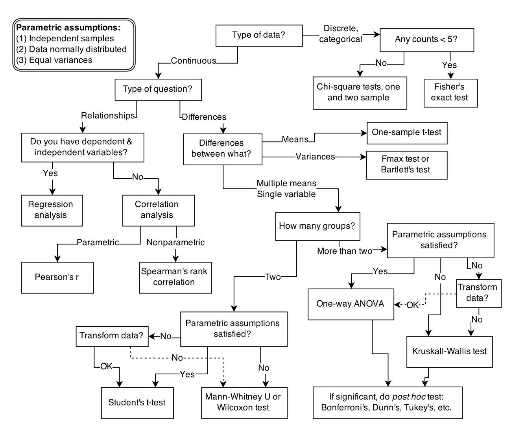

```{r, message=FALSE}
library(devtools)
devtools::install_github("rmcelreath/rethinking",ref="Experimental")
```


# 9.1: Statistical Golems

Scientific models are constructs engineered for some purpose. These constructs are incredibly powerful, dutifully conducting their programmed calculations.

{width=60%, height=100%}

Golems do not possess any inherent intelligence. All it knows is the cookbook: the set of instructions to carry out and the order in which to do them, yielding some sort of final product. 


# 9.2: Statistical Rethinking

The greatest obstacle people encounter is the tacit belief that the proper objective of statistical inference is to test null hypotheses. This is the proper objective, the thinking goes, because Karl Popper argued that science works better by developing hypotheses that are, in principle, falsifiable. Seeking out evidence that might embarrass our ideas is a normative standard, and one that scholars subscribe to. However, science is not described by the falsification standard, and popper recognized that. In fact, deductive falsification is impossible in nearly every scientific context. In this section, we will review two reasons for this impossibility:

1. Hypotheses are not models. The relationship among hypotheses and different kinds of models are complex. Many models correspond to the same hypotheses, and many hypotheses correspond to a single model. This makes strict falsification impossible. 

2. Measurements matter. Even when we think the data falsify a model, another observer will debate our methods and measures. They don't trust the data. Sometimes they are right.

For both of these reasons, deductive falsification never works. The scientific method cannot be reduced to a statistical procedure, and so our statistical methods should not pretend. If you believe that science does often work, then learning that it doesn't work via falsificatino shouldn't change your mind. But it might help you do better science, because it will open your eyes to many legitimately useful functions of statistical golems.


